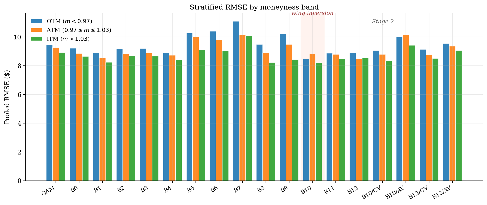
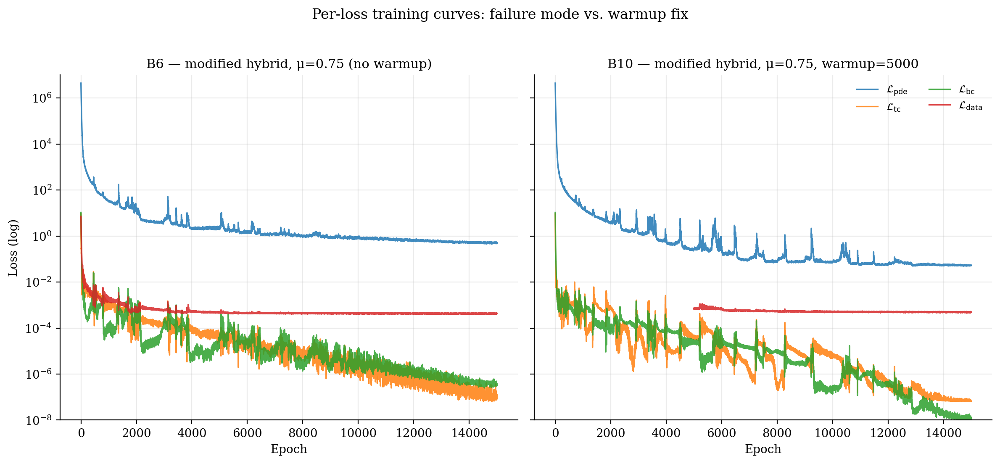

```{python}
#| label: setup
#| include: false
# Boilerplate for every chunk that follows. Paths are resolved relative
# to the project root because Quarto runs each chunk in the .qmd's dir.
import json
import os
import sys
from pathlib import Path

import numpy as np
import pandas as pd

# Anchor at project root so we can pull from results/ and reports/
HERE = Path(os.getcwd())
ROOT = HERE.parent if HERE.name == "paper" else HERE
RESULTS = ROOT / "results"
REPORTS = ROOT / "reports"
RUNS    = ROOT / "runs"
FIGS    = HERE / "figures"
TABLES  = HERE / "tables"
FIGS.mkdir(exist_ok=True)
TABLES.mkdir(exist_ok=True)

def load_json(p):
    p = Path(p)
    return json.load(open(p)) if p.exists() else None

def fmt_dollar(x, nd=2):
    return "—" if x is None or (isinstance(x, float) and np.isnan(x)) else f"\\${x:.{nd}f}"

def fmt_pct(x, nd=1):
    return "—" if x is None or (isinstance(x, float) and np.isnan(x)) else f"{x*100:.{nd}f}\\%"

def short_tag(name):
    """Map a verbose master-table config to the compact label used in
    figures (B10, B12/CV, BS, GAM, …). Keeps tables narrow enough to fit
    on one PDF page without the underscore-laden line-breaking that
    Pandoc otherwise produces."""
    if name.startswith("S2_"):
        parts = name.split("_")
        return f"{parts[1]}/{parts[2][0].upper()}V"   # S2_B10_cvol → B10/CV
    if name.startswith("B"):
        return name.split("_")[0]                     # B10_modified_… → B10
    return name.split("_")[0]                         # BS_A1 → BS, etc.

# pandas.to_markdown() is the table-rendering backbone. requires the
# `tabulate` package (pip install tabulate). Pandoc parses the resulting
# GFM table when a chunk emits it via the `#| output: asis` directive.
# Always pass `na_rep="—"` so empty / NaN cells render as em-dashes
# instead of the default "nan" string.
```

\pagebreak 

# Introduction

The Black–Scholes formula [@blackscholes1973; @merton1973] remains the
reference language of derivatives pricing despite decades of empirical
evidence that its constant-volatility assumption is wrong. The two
dominant responses (calibrating local or stochastic volatility models
[@dupire1994; @heston1993], or fitting flexible machine-learning
regressors to market quotes) solve different parts of the problem and
inherit different limitations. Calibration imposes structure but
suffers parameter instability across regimes. Pure ML methods deliver
fit but offer no guarantee that the resulting prices are even
*internally consistent*: arbitrage violations such as butterfly or
calendar negatives are routinely tolerated because they are rarely
measured.

Physics-informed neural networks (PINNs) [@raissi2019] are appealing
in this setting because they enforce the pricing PDE as a soft
constraint during training. In principle, this combines the structural
discipline of model-based pricing with the flexibility of neural
function approximation. In practice, the PINN literature on options
pricing has three recurrent gaps:

1. experiments use synthetic data or single in-sample fits rather
   than walk-forward backtests;
2. the volatility entering the PDE is held *constant*, identical to a
   single-$\sigma$ Black–Scholes baseline, eliminating the very degree of
   freedom the network is meant to learn;
3. no-arbitrage properties of the trained surface are reported only
   when they happen to be clean.

This paper closes those three gaps on a single-name equity option
dataset (TSLA, 2020). Our contributions are:

1. Walk-forward PINN benchmark. Nine monthly folds across 2020,
   strict val-best snapshot reporting, and a 13-configuration
   architecture ablation (random weight factorization $\mu$ \times
   loss-balancing strategy \times hybrid vs. physics-only mode). Stage 1
   establishes that with appropriate Modified-MLP + RWF + Fourier-feature
   architecture [@wang2023expert; @tancik2020fourier] and a PDE-warmup
   schedule, the PINN matches a per-fold-$\sigma$ Black–Scholes baseline on
   pooled RMSE while introducing a *wing inversion* in stratified
   error: the only configuration in our ablation grid where
   out-of-the-money and in-the-money RMSE both improve relative to
   at-the-money.

2. Stage 2: learnable $\sigma$ surface. We replace the constant-$\sigma$
   assumption inside the PDE with a learned surface
   $\sigma_\theta(F,\tau)$ realised via two parametrizations: a
   multiplicative *C-Vol* wrapper
   $\sigma(F,\tau) = \sigma_0 \cdot \mathrm{softplus}(g_\theta(F,\tau))$
   and a direct *A-Vol* parametrization
   $\sigma(F,\tau) = \sigma_\mathrm{init} + \mathrm{softplus}(g_\theta(F,\tau))$.
   Both are warm-started from the two endpoints of the Stage 1
   ablation: B10 (best pricing accuracy, structural arb violations) and
   B12 (cleanest no-arb surface, marginally worse pricing).

3. Arbitrage as a first-class metric. Every reported model is
   evaluated for butterfly and calendar arbitrage on a dense
   $(F,\tau)$ grid. We treat the violation rate as a primary metric
   on equal footing with RMSE, exposing the trade-off that pure-RMSE
   reporting conceals.

4. Honest non-PINN baselines. A residual GAM [@wood2017gam] and a
   local approximate Gaussian process [@gramacy2016lagp] are evaluated
   under identical walk-forward folds and the strict feature set the
   PINN sees, removing regime-indicator contamination present in
   earlier formulations. The laGP fit additionally produces native
   95% predictive intervals that we retain as the comparison baseline
   for the uncertainty extension outlined in
   Section [-@sec-discussion].

```{python}
#| label: tbl-headline
#| tbl-cap: "Headline results: pooled RMSE in dollars and arbitrage violation rates across baseline classes. The wing-inversion case (wing RMSE below ATM RMSE) appears only in the B10 configuration."
#| output: asis
mt = pd.read_csv(REPORTS / "master_table.csv") if (REPORTS / "master_table.csv").exists() else None
if mt is not None:
    keep = ["BS_A1", "GAM_A2", "LAGP_A3",
            "B0_standard_physics", "B1_standard_hybrid",
            "B10_modified_hybrid_mu0.75_warmup5000",
            "B12_modified_hybrid_mu0.25_warmup5000"]
    sub = mt[mt["config"].isin(keep)].copy()
    sub["Config"] = sub["config"].apply(short_tag)
    show_cols = ["Config", "pooled_rmse", "pooled_rmse_atm",
                 "pooled_rmse_wing", "arb_butterfly%", "arb_calendar%"]
    show_cols = [c for c in show_cols if c in sub.columns]
    sub = sub[show_cols].rename(columns={
        "pooled_rmse":        "RMSE",
        "pooled_rmse_atm":    "ATM",
        "pooled_rmse_wing":   "Wing",
        "arb_butterfly%":     "Butt %",
        "arb_calendar%":      "Cal %",
    })
    # Format numerics first; replace any remaining NaN with em-dash so the
    # table doesn't show 'nan' in cells where the baseline didn't compute
    # a stratified or arbitrage value.
    sub = sub.map(
        lambda v: "—" if pd.isna(v) else (f"{v:.3f}" if isinstance(v, float) else v)
    )
    print(sub.to_markdown(index=False, disable_numparse=True))
else:
    print("*Table will populate once `python scripts/build_master_table.py` "
          "has been run after Stage 2 results land.*")
```

The remainder of the paper is organized as follows.
Section [-@sec-background] reviews the necessary PDE and PINN background.
Section [-@sec-methodology] details data preprocessing, walk-forward
methodology, and the three-stage architecture.
Section [-@sec-stage1] presents Stage 1 ablation results.
Section [-@sec-stage2] the Stage 2 vol-surface results.
Section [-@sec-baselines] compares against non-PINN baselines.
Section [-@sec-discussion] discusses limitations and outlines the
uncertainty-quantification extension; Section [-@sec-conclusion]
concludes.

\pagebreak 

# Background {#sec-background}

## The Black–Scholes pricing PDE

For a European call on a non-dividend-paying underlying $S_t$ under
the risk-neutral measure with constant interest rate $r$ and
volatility $\sigma$, the option price $V(S,t)$ satisfies

$$
\frac{\partial V}{\partial t}
+ \frac{1}{2}\sigma^2 S^2 \frac{\partial^2 V}{\partial S^2}
+ r S \frac{\partial V}{\partial S} - r V = 0,
$$ {#eq-bs-pde}

with terminal condition $V(S, T) = (S - K)^+$ and boundary conditions
$V(0, t) = 0$, $V(S, t) \to S - K e^{-r(T-t)}$ as $S \to \infty$.

We work in non-dimensionalised coordinates throughout: moneyness
$m = F/K$ where $F = S e^{(r-q)(T-t)}$ is the forward price, time to
expiry $\tau = T - t$, and price $\hat v = V/K$.

## Physics-informed neural networks

A PINN $\hat v_\phi(m,\tau)$ is trained to minimise a composite loss

$$
\mathcal{L}(\phi) = \lambda_\mathrm{pde}\mathcal{L}_\mathrm{pde}
+ \lambda_\mathrm{tc}\mathcal{L}_\mathrm{tc}
+ \lambda_\mathrm{bc}\mathcal{L}_\mathrm{bc}
+ \lambda_\mathrm{data}\mathcal{L}_\mathrm{data}
+ \lambda_\mathrm{reg}\mathcal{L}_\mathrm{reg},
$$ {#eq-loss}

where $\mathcal{L}_\mathrm{pde}$ is the squared residual of
@eq-bs-pde at collocation points, $\mathcal{L}_\mathrm{tc}$ and
$\mathcal{L}_\mathrm{bc}$ enforce terminal and boundary conditions,
$\mathcal{L}_\mathrm{data}$ is the mean squared error against market
mid-prices, and $\mathcal{L}_\mathrm{reg}$ regularises soft-plus
arguments. The adaptive weights $\{\lambda_i\}$ are updated via the
gradient-norm scheme of @wang2023expert.

## No-arbitrage diagnostics

A theoretical option price surface $V(K,\tau)$ must satisfy two
inequalities almost everywhere:

$$
\frac{\partial^2 V}{\partial K^2} \ge 0
\quad\text{(butterfly, convexity in strike)},
$$ {#eq-butterfly}

$$
\frac{\partial V}{\partial \tau} \ge 0
\quad\text{(calendar, monotonicity in maturity)}.
$$ {#eq-calendar}

We measure violation rates by Monte Carlo over a dense $(K,\tau)$ grid;
see Section [-@sec-methodology] for the implementation.

\pagebreak 


# Methodology {#sec-methodology}

The three stages compose incrementally: Stage 1 inherits Stage 0's
PDE residual + boundary conditions and adds Modified-MLP, Random
Weight Factorization, Fourier-feature inputs, gradient-norm balancing,
the market-data loss, walk-forward folds, and val-best snapshot
reporting; Stage 2 inherits all of that and adds a learned
$\sigma_\theta(F,\tau)$ network jointly trained with a warm-started
pricing net (Figure [-@fig-architecture]).

{#fig-architecture width=100%}

## Data and walk-forward folds

We use end-of-day TSLA option chain quotes from 2020, split-adjusted
for the August 2020 5:1 stock split. After standard cleaning (positive
mid-price, in-the-money intrinsic value bounds, removal of
zero-volume quotes), the cleaned panel contains 59,668 option-day
observations across 252 trading days.

Folds are monthly and walk-forward: for fold $f$ (test month $M_f$),
training spans all data strictly before the start of $M_{f-1}$, the
last calendar month of training is held out as the validation set
$M_{f-1}$, and the test set is $M_f$ (Figure [-@fig-walkforward]).
This yields nine folds covering April through December 2020.
Per-fold constants are computed *only* from training data:
$\sigma_\mathrm{fixed}$ is the median of ATM implied volatilities
and $r_\mathrm{fixed}$ the cross-sectional mean of risk-free rates.

{#fig-walkforward width=90%}

## PINN architecture

The pricing network is a Modified-MLP [@wang2023expert], an
encoder-gated multi-layer perceptron whose two parallel encoder
streams give the network better gradient flow than a vanilla MLP
of equivalent depth, which matters because the PDE residual asks
for stable second-order derivatives. Inputs pass first through a
Fourier feature embedding [@tancik2020fourier], which expands
the low-dimensional input $(m,\tau)$ into a higher-dimensional
sinusoidal basis; this is what allows the network to capture the
high-frequency curvature of the volatility smile without
saturating its early layers on essentially-flat low-frequency
features. Every linear layer is reparametrised with Random
Weight Factorization (RWF) $\mathbf{W} = \mathrm{diag}(s)\,
\hat{\mathbf{W}}$ with scale vector $s \sim \mathcal{N}(\mu,
\sigma_\mathrm{init}^2)$; this rescales the per-neuron gradient
norms so that grad-norm balancing (Section [-@sec-training]) does
not have to cancel pathological per-layer gradient magnitudes
before it can balance the *loss-term* gradients we actually care
about. All activations are $\tanh$ to permit second-order autograd
for the PDE residual.

We sweep a $\mu \in \{0.0, 0.25, 0.5, 0.75, 1.0\}$ ablation in
combination with: hybrid vs. physics-only loss, fixed vs.
gradient-norm-balanced data weight, and PDE-warmup vs. immediate-data
training. The full grid is reported in Section [-@sec-stage1].

## Training protocol {#sec-training}

The composite loss in Equation [-@eq-loss] mixes terms with very
different gradient magnitudes (the PDE residual is naturally
$O(10^{-2})$, the market-data MSE is $O(10^{0})$ in non-dimensional
units), so a fixed weighting collapses one term against another.
We adopt the gradient-norm scheme of @wang2023expert: every
$T_g{=}100$ epochs the active loss weights are updated as

$$
\lambda_i \;\leftarrow\; (1-\alpha)\,\lambda_i
+ \alpha \cdot \frac{\max_j \lVert \nabla_\phi \mathcal{L}_j \rVert}
                     {\lVert \nabla_\phi \mathcal{L}_i \rVert + \varepsilon},
\qquad \alpha = 0.1,
$$ {#eq-grad-norm}

with $\nabla_\phi$ over all trainable pricing-net parameters. The
weights for the terminal- and boundary-condition terms
$(\lambda_\mathrm{tc},\lambda_\mathrm{bc})$ are floored at 10 to
prevent the scheme from sending them to zero on long runs.

### Two overfitting modes

PINN-pricing under the hybrid loss admits two distinct overfitting
dynamics that we have to control for separately:

* Generic supervised overfitting.
  $\mathcal{L}_\mathrm{data}$ continues to admit arbitrarily small
  training error as the network increases capacity to fit
  idiosyncratic mid-quote noise. This is the textbook supervised
  failure mode and the val-best mechanism below is the standard
  defence against it.

* Gradient-norm collapse (the PINN-specific failure).
  The gradient-norm scheme of Equation [-@eq-grad-norm] amplifies
  whichever term has the largest gradient. Because
  $\mathcal{L}_\mathrm{data}$ decreases more slowly than the
  PDE / TC / BC terms in late training, the scheme keeps lifting
  $\lambda_\mathrm{data}$ to compensate. Once it drifts far enough,
  the *PDE dominance ratio*
  $\rho(t) = \lambda_\mathrm{pde}\mathcal{L}_\mathrm{pde}/
  (\lambda_\mathrm{tc}\mathcal{L}_\mathrm{tc} +
  \lambda_\mathrm{bc}\mathcal{L}_\mathrm{bc})$
  falls below unity and the optimiser is pulled away from
  PDE-consistent solutions toward arbitrage-violating minima of the
  data loss. Section [-@sec-stability] documents this regime
  empirically; the PDE-warmup schedule defined later in this
  section is the structural fix that prevents it from ever being
  reached.

### Val-best snapshot reporting

To guard against both modes simultaneously without conflating them,
each fold uses a single training run with val-best snapshot
reporting:

1. Initialise the model with seed $S=42$.
2. Train for $E_\mathrm{max}=15,000$ epochs on the train window
   only; evaluate val RMSE every $T_v{=}250$ epochs.
3. Snapshot the full $(\phi, \theta)$ state whenever val RMSE
   improves on the running best.
4. After the loop, restore the val-best snapshot and evaluate the
   test month *once*. Reported numbers are this single
   post-restore evaluation.

The reported epoch $E^\star$ is therefore the last point at which
the val curve was still improving, a deterministic readout of the
fold's effective training horizon. Test data are touched exactly
once per fold; the val window is held out from training and used
*only* to drive snapshot selection. Saved checkpoints are the
val-best states; Stage 2 warm-starts from the same val-best
$\phi$, so the val window is held out from Stage 2's optimisation
horizon as well.

### PDE-warmup schedule

For configurations with `--data_loss_warmup` $= W > 0$ (B10–B12 in
our grid), the data term is *deactivated* for the first $W$ epochs:
the model is trained as a physics-only PINN (PDE + TC + BC
residuals), letting the gradient-norm scheme settle on a balanced
$(\lambda_\mathrm{pde},\lambda_\mathrm{tc},\lambda_\mathrm{bc})$
inside a region of parameter space where the no-arbitrage geometry
is established. At epoch $W{+}1$ the data term is admitted with
$\lambda_\mathrm{data}\!\leftarrow\!1$, and joint
gradient-norm balancing resumes. The warmup window $W{=}5,000$
was selected empirically as the point at which
$\rho(t) \to O(1)$ for the physics-only run; longer warmups
provide diminishing returns, shorter warmups fail to establish
the balance before $\mathcal{L}_\mathrm{data}$ is admitted. The
ablation in Section [-@sec-stage1] shows that this single
schedule choice, together with the val-best snapshot, is
responsible for the gap between the hybrid-collapse configurations
(B5–B7) and the Pareto-frontier configurations (B10–B12).

## Stage 2: learnable volatility

A second network $g_\theta(F,\tau)$ produces the volatility surface.
We compare two parametrizations:

$$
\sigma_\mathrm{C}(F,\tau)
  = \sigma_0 \cdot \mathrm{softplus}\bigl(g_\theta(F,\tau)\bigr),
\qquad
\sigma_\mathrm{A}(F,\tau)
  = \sigma_\mathrm{init} + \mathrm{softplus}\bigl(g_\theta(F,\tau)\bigr),
$$ {#eq-vol-params}

where $\sigma_0$ is the per-fold-$\sigma_\mathrm{fixed}$ anchor
(C-Vol) and $\sigma_\mathrm{init}$ is the same value used as an
additive offset (A-Vol). The pricing network is warm-started from a
Stage 1 fold checkpoint; the volatility network is trained from
scratch with its own learning rate $\eta_\mathrm{vol} = 10^{-3}$,
above the pricing fine-tune rate $\eta_\mathrm{price} = 10^{-4}$.

## Baselines {#sec-baselines-method}

Three non-PINN baselines run on identical fold definitions:

* A1: Black–Scholes (per-fold $\sigma$). Closed-form
  @eq-bs-pde with $\sigma = \sigma_\mathrm{fixed}$ and
  $r = r_\mathrm{fixed}$ both computed from training data only.
* A2: Residual GAM. Target is $y = \mathrm{mid} - V_\mathrm{BS}$,
  fit with `mgcv::gam` using
  $y \sim \mathrm{te}(m,\tau,k=(8,5)) + \mathrm{ns}(\log v, \mathrm{df}=2)$,
  REML smoothing.
* A3: Residual laGP. Same target as A2; local approximate GP
  with start=6, end=50 [@gramacy2016lagp], yielding native 95%
  predictive intervals retained as the credible-interval baseline
  for the uncertainty extension in Section [-@sec-uq-future].

\pagebreak 

# Stage 1: Walk-forward ablation {#sec-stage1}

```{python}
#| label: tbl-stage1
#| tbl-cap: "Full Stage 1 ablation (B0–B12) with the architectural parameters that distinguish each cell (loss type, RWF $\\mu$, and PDE-warmup window (epochs)) followed by pooled RMSE in dollars across all 9 folds and the butterfly / calendar arbitrage violation rates. B0 and B1 use the standard MLP architecture (no RWF, hence no $\\mu$ entry). B9 shares its three-parameter signature with B6 but additionally pins $\\lambda_\\mathrm{data}=1000$ instead of using gradient-norm balancing. The wing-inversion case (wing RMSE below ATM RMSE) appears only in B10 (modified-hybrid, $\\mu = 0.75$, warmup = 5000)."
#| output: asis
import re
if mt is not None:
    # Match B0..B12 PINN configs only — exclude BS_A1 (which also starts with "B")
    show = mt[mt["config"].str.match(r"^B\d")].copy()
    show["Config"]  = show["config"].apply(short_tag)
    # Loss: physics-only vs hybrid (data + PDE)
    show["Loss"]    = show["mode"].map({"physics": "Physics",
                                         "hybrid":  "Hybrid"}).fillna("—")
    # μ: RWF init scale; format as fixed-decimal so 0 → 0.00 etc.
    show["μ"]       = show["mu"].apply(
        lambda v: "—" if pd.isna(v) else f"{float(v):.2f}")
    # Warmup epochs: parse `_warmup(\d+)` out of the raw config string;
    # 0 if absent (matches the run_walk_forward.py default).
    show["Warmup"]  = show["config"].apply(
        lambda s: (m.group(1) if (m := re.search(r"_warmup(\d+)", s)) else "0"))

    cols = ["Config", "Loss", "μ", "Warmup",
            "pooled_rmse", "pooled_rmse_otm", "pooled_rmse_atm",
            "pooled_rmse_itm", "pooled_rmse_wing",
            "arb_butterfly%", "arb_calendar%"]
    cols = [c for c in cols if c in show.columns]
    show = show[cols].rename(columns={
               "μ"   :      "$\\mu$",
        "pooled_rmse":      "RMSE",
        "pooled_rmse_otm":  "OTM",
        "pooled_rmse_atm":  "ATM",
        "pooled_rmse_itm":  "ITM",
        "pooled_rmse_wing": "Wing",
        "arb_butterfly%":   "Butt %",
        "arb_calendar%":    "Cal %",
    })
    show = show.map(
        lambda v: "—" if pd.isna(v) else (f"{v:.3f}" if isinstance(v, float) else v)
    )
    print(show.to_markdown(index=False, disable_numparse=True))
else:
    print("*Awaiting `reports/master_table.csv`.*")
```

## Headline: pricing accuracy vs. arbitrage consistency {#sec-pareto}

Because PINNs in this setting face two competing objectives
(fitting market data accurately versus obeying the no-arbitrage
geometry that financial mathematics imposes), we evaluate the
benchmark as a *multi-objective* optimisation problem rather than
a single-metric leaderboard. The Pareto frontier is the set of
configurations for which neither objective can be improved without
degrading the other: every model on the frontier is incomparable
to every other model on the frontier under any monotone preference
between RMSE and arbitrage consistency, and every model *off* the
frontier is dominated (some on-frontier model beats it on both
axes). Reporting a single number hides this trade-off; reporting
the frontier exposes it.

Figure [-@fig-arb-rmse-pareto] plots the pooled RMSE against the
combined butterfly + calendar arbitrage violation rate for the full
benchmark, comprising 13 Stage 1 ablation cells and four Stage 2
cells (B10 and B12 warm-starts crossed with C-Vol and A-Vol
parametrizations), with the
BS_A1 and GAM_A2 baselines as horizontal references. B10
(modified-hybrid, $\mu = 0.75$, warmup = 5,000) sits at the
lower-right of the Stage 1 frontier: lowest pooled RMSE of any
configuration *and* below the BS_A1 baseline, at the price of a
51% arbitrage-violation rate. B11 and B12 lift to the upper-left
of the frontier: slightly worse RMSE (still below or near BS_A1)
in exchange for substantially lower arbitrage. Stage 2 cells extend
the frontier further left: each parametrization trades RMSE for arb%
along an architecture-specific direction, with B12/A-Vol the
left-most point in the entire benchmark (8.5% total violations,
RMSE $9.41). Configurations without warmup (B5–B7) collapse to the
upper-right, occupying the worst quadrant of high RMSE *and*
high arb%.

![Pricing accuracy vs. arbitrage consistency across the full benchmark. B10 (red star) is the lowest-RMSE Stage 1 configuration; the warmup family (B11, B12, blue) trades roughly \$0.3 of RMSE for about 30 percentage points of arbitrage reduction. Stage 2 C-Vol (orange circles) and A-Vol (green squares) extend the frontier further left, with B12/A-Vol at 8.5% total violations the cleanest model in the benchmark. Hybrid configurations without PDE-warmup (B5–B7) collapse to the upper-right "worst" quadrant.](figures/fig-arb-rmse-pareto.png){#fig-arb-rmse-pareto width=90%}

## The wing-inversion finding {#sec-wing-inversion}

Stage 1 fixes a single volatility $\sigma_\mathrm{fixed}$ inside the
PDE for the entire fold. Under the hybrid loss every Stage 1 model
is therefore caught in a tug-of-war: the PDE residual
$\mathcal{L}_\mathrm{pde}$ pulls the price surface back towards a
flat-volatility Black–Scholes solution that does not curve at the
wings, while $\mathcal{L}_\mathrm{data}$ pulls it towards the
empirical, smile-shaped market surface. For most configurations the
PDE side wins and the model collapses to an essentially flat-$\sigma$
residual; market deviations are absorbed into a uniform error band
that is largest where the smile is steepest, producing the standard
OTM $\geq$ ATM $\geq$ ITM pattern in stratified RMSE.

Figure [-@fig-stratified-rmse] decomposes pooled RMSE by moneyness
band. Across the GAM baseline and 16 of the 17 PINN cells (Stage 1
B0–B12 and Stage 2 B10/B12 × cvol/avol alike) RMSE follows the
classical pattern OTM $\geq$ ATM $\geq$ ITM: volatility-skew
effects dominate the residual error in the wings.
B10 is the only configuration where this ordering inverts: ATM
RMSE (\$8.83) exceeds both OTM RMSE (\$8.48) and ITM RMSE (\$8.21).
Equivalently, the *wing* RMSE, pooled across OTM and ITM, drops
below the ATM RMSE. This is the structural signature of a PINN
where the data-driven curvature has *overpowered* the
constant-volatility constraint precisely in the wings, where the
smile has the most curvature. The cost is paid in arbitrage:
B10's pricing network must fold smile-shaped local convexity onto a
single-$\sigma$ PDE solution, and the resulting surface registers the
33 percentage-point butterfly violation rate visible in
Figure [-@fig-arb-rmse-pareto]. Configurations with the same $\mu$
but no warmup (B6), or warmup with different $\mu$ (B11, B12),
never exhibit this inversion: in those cases the constraint side
wins and the wings are flattened. Neither do B10's Stage 2
successors, which we will see absorb the same smile information
into the volatility surface itself (Section [-@sec-stage2]) and
therefore revert to the classical pattern without paying the arb
cost.

{#fig-stratified-rmse width=100%}

## Stability and convergence diagnostics {#sec-stability}

The non-warmup hybrid configurations B5–B7 collapse on RMSE *and*
on arbitrage simultaneously (Figure [-@fig-arb-rmse-pareto]). The
overfitting mechanism foreshadowed in
Section [-@sec-training], in which gradient-norm-balanced
$\lambda_\mathrm{data}$ drifts upward as
$\mathcal{L}_\mathrm{data}$ falls more slowly than the PDE / TC /
BC residuals and suppresses the PDE-consistency signal, is directly
visible in the per-loss curves and adaptive-weight trajectories.
Figure [-@fig-loss-curves-stability] contrasts B6 (failure mode:
modified hybrid, $\mu=0.75$, no warmup) with B10 (same architecture
plus the 5,000-epoch PDE-warmup defined in
Section [-@sec-training]) on the November 2020 fold. In B6 the
market-data loss enters at full strength from epoch 1 and is
poorly balanced by Equation [-@eq-grad-norm]; the adaptive weight
$\lambda_\mathrm{data}$ runs to $\sim 10^{5}$
(Figure [-@fig-weight-traj-stability]), which numerically
suppresses the PDE residual. The dominance ratio $\rho(t)$
collapses below unity early in training and stays there
(Figure [-@fig-pde-dominance]); the val curve reaches its
minimum well before the loop terminates and val-best snapshot
selection (Section [-@sec-training], step 3) restores a model
trained from a regime where the no-arbitrage geometry has already
been corrupted; hence the 51% combined arb-violation rate at the
reported epoch. The 5,000-epoch warmup window in B10 lets
$\mathcal{L}_\mathrm{pde}$, $\mathcal{L}_\mathrm{tc}$, and
$\mathcal{L}_\mathrm{bc}$ converge to a stable balance *before*
the data loss is admitted; once $\mathcal{L}_\mathrm{data}$ enters,
$\rho(t)$ stays above unity, $\lambda_\mathrm{data}$ remains
bounded, and the val-best epoch falls at a point inside the
PDE-consistent basin established during warmup. Val-best snapshot
reporting and PDE-warmup are therefore complementary: the snapshot
mechanism guards against late-epoch overfitting in the
generic-supervised sense, and the warmup schedule prevents the
optimisation trajectory from leaving the no-arbitrage region in
the first place.


{#fig-loss-curves-stability width=80%}

{#fig-weight-traj-stability width=80%}

\clearpage 

{#fig-pde-dominance width=80%}

![Validation RMSE on Nov 2020 (log scale) with the val-best epoch $E^\star$ marked on each curve. B10's val curve is monotonically smoother and reaches a lower minimum than B6's, even though both start at the same RMSE; B6 plateaus higher and noisier, the val-curve fingerprint of the unstable optimisation regime documented in Figures [-@fig-loss-curves-stability]–[-@fig-pde-dominance]. The shaded band marks B10's PDE-warmup window.](figures/fig-val-curve-mu-warmup.png){#fig-val-curve-stability width=80%}


## $\mu \times \mathrm{warmup}$: substitutes, not complements {#sec-mu-warmup}

Within the warmup family (B10/B11/B12), pooled RMSE rises by \$0.26
as $\mu$ drops from 0.75 to 0.25, and the wing inversion is lost
(Figure [-@fig-stratified-rmse]). The same direction is reflected in
the val-best epoch reported in
Section [-@sec-stage1] for each fold's training: B10's mean
$E^\star$ across the nine folds is 6,167; B11's is 6,222;
B12's drops to 4,667. The lower-$\mu$ initialisation is closer
to flat-$\sigma$ BS, so the network has less to learn before the
val curve flattens. We conclude that $\mu$-tuning and the warmup
phase are substitutes: warmup does the heavy lifting of
restoring stability under hybrid losses, and $\mu = 0.75$ is the
companion that maximises the pricing benefit; lowering $\mu$
inside warmup gives back most of the gain without an offsetting
reduction in arbitrage.

# Stage 2: learnable volatility surface {#sec-stage2}

The Stage 1 ablation forced every PINN to express market-implied
smile structure inside a model that fixes a single
$\sigma_\mathrm{fixed}$. The price the best-RMSE configuration paid
to do this, visible as the wing inversion of
Section [-@sec-wing-inversion] and the 51% combined arb-violation
rate of Figure [-@fig-arb-rmse-pareto], is fundamentally a
representational mismatch: a smile-shaped surface cannot live in
the constant-volatility solution space without breaking the
no-arbitrage convexity of that space. Stage 2 acts as a pressure
valve on this mismatch. By replacing $\sigma_\mathrm{fixed}$
inside the PDE with a learnable surface
$\sigma_\theta(F,\tau)$, market complexity that previously had to
distort the price network is now absorbed directly into the
volatility specification, where it is properly bounded by the
SoftPlus parametrization. The pricing network can then return to a
genuinely PDE-consistent solution; the smile lives where it
belongs, in $\sigma$.

We use the two endpoints of the Stage 1 frontier as Stage 2
warm-starts. To keep their roles in mind, we attach functional
labels:

* B10 (Max-Accuracy): modified-hybrid, $\mu = 0.75$,
  warmup = 5,000. Lowest pooled RMSE in Stage 1 (\$8.49); pays for
  it with substantial arb violations (32% butterfly, 19% calendar)
  and the wing-inversion artefact.
* B12 (Max-Consistency): modified-hybrid, $\mu = 0.25$,
  warmup = 5,000. RMSE only \$0.26 worse than B10 (\$8.75) but
  arb-clean (21% butterfly, *1.7%* calendar) and free of wing
  inversion.

The $2 \times 2$ design crosses these two warm-starts with the two
volatility parametrizations C-Vol and A-Vol, isolating the
respective contributions of the Stage 1 starting point and the
inductive bias on $\sigma_\theta$.

\pagebreak

```{python}
#| label: tbl-stage2
#| tbl-cap: "Stage 2 walk-forward results: $2 \\times 2$ design crossing the two Stage 1 warm-starts (B10 = Max-Accuracy, B12 = Max-Consistency) with the two volatility parametrizations (C-Vol, A-Vol)."
#| output: asis
s2_paths = {
    "B10 (Max-Acc.)/C-Vol":  RUNS / "stage2_B10" / "cvol" / "results.json",
    "B10 (Max-Acc.)/A-Vol":  RUNS / "stage2_B10" / "avol" / "results.json",
    "B12 (Max-Cons.)/C-Vol": RUNS / "stage2_B12" / "cvol" / "results.json",
    "B12 (Max-Cons.)/A-Vol": RUNS / "stage2_B12" / "avol" / "results.json",
}
rows = []
for name, p in s2_paths.items():
    r = load_json(p)
    if r is None:
        rows.append({"Config": name, "pooled RMSE": "—",
                     "ATM": "—", "OTM": "—", "ITM": "—",
                     "butt%": "—", "cal%": "—"})
    else:
        s = r["summary"]
        rows.append({
            "Config": name,
            "pooled RMSE": f"\\${s['pooled_rmse_mkt']:.3f}",
            "ATM":         f"\\${s['pooled_rmse_atm']:.3f}",
            "OTM":         f"\\${s['pooled_rmse_otm']:.3f}",
            "ITM":         f"\\${s['pooled_rmse_itm']:.3f}",
            "butt%":       f"{s['mean_arb_butterfly_ratio']*100:.1f}\\%",
            "cal%":        f"{s['mean_arb_calendar_ratio']*100:.1f}\\%",
        })
print(pd.DataFrame(rows).to_markdown(index=False, disable_numparse=True))
```

C-Vol vs A-Vol: the inductive-bias finding.
Across both warm-starts the multiplicative C-Vol parametrization
delivers consistently lower RMSE than the additive A-Vol
parametrization at the cost of higher residual arbitrage:
B10 (Max-Accuracy) / C-Vol \$8.85 vs. B10 / A-Vol \$9.90 on pooled
RMSE (C-Vol −\$1.05); B12 (Max-Consistency) / C-Vol \$8.94 vs.
B12 / A-Vol \$9.41 (−\$0.47). The arb–RMSE ordering reverses on the
consistency axis: A-Vol attains the lowest arbitrage-violation rates
of any model in the benchmark (B12 / A-Vol: 8.2% butterfly + 0.3%
calendar = 8.5% total), while C-Vol stays in the 14–34% range. The
interpretation is structural: the multiplicative form
$\sigma_0\,\mathrm{softplus}(g_\theta)$ with $\sigma_0$ anchored at
the per-fold ATM-IV median sits in a smaller, smoother subset of
the allowable $\sigma$-surface space: easier to optimise to low RMSE,
harder to bend into arbitrage-violating geometries.

Warm-start dependence.
Stage 2 inherits the Pareto-frontier ordering from Stage 1: the
B10 (Max-Accuracy) warm-start produces lower-RMSE / higher-arb
Stage 2 models, and the B12 (Max-Consistency) warm-start yields
cleaner Stage 2 models. The two warm-starts *reach* their
respective Stage 2 endpoints by qualitatively different mechanisms:
under B10 / C-Vol the volatility network learns a substantial
multiplier surface with $\mu_{C}(F,\tau) \in [0.5, 1.0]$
(Figure [-@fig-vol-surface-b10-cvol]), i.e.\ a learned $\sigma$
ranging from $0.39$ to $0.78$, effectively redistributing the
smile structure that the Max-Accuracy pricing net had previously
encoded as arb-violating curvature. Under B12 (Max-Consistency)
/ C-Vol the multiplier collapses to $\approx 1.000\pm 0.005$: the
B12 warm-start was already close to flat-$\sigma$ BS, so the
volatility network has nothing to add and remains essentially
inert. The Stage 1 endpoints therefore behave as two distinct
warm-start regimes for Stage 2, and the $2\times 2$ design
separates the respective contributions of warm start and
parametrization.

{#fig-vol-surface-b10-cvol width=95%}

{#fig-vol-surface-b12-cvol width=95%}

Wing-inversion under Stage 2.
The Stage 1 wing inversion identified for B10 (Max-Accuracy) in
Section [-@sec-wing-inversion] does *not* survive Stage 2:
B10 / C-Vol returns to the classical OTM $\geq$ ATM $\geq$ ITM
pattern (\$9.07 / \$8.79 / \$8.32). This is the pressure-valve
effect made concrete: the structural deviation from flat-$\sigma$
that manifested as a wing-inversion artefact in the Max-Accuracy
Stage 1 pricing net is absorbed by the volatility network in
B10 / C-Vol, where it is properly bounded by the no-arbitrage
constraints implicit in the SoftPlus parametrization. The smile
moves from the price surface (where it caused arb violations) to
the volatility surface (where it is admissible).

Convergence speed.
All four Stage 2 configurations select their val-best epoch
substantially earlier than the corresponding Stage 1 configurations:
$E^\star \in \{2,222, 2,389, 2,444, 4,861\}$ for the four
Stage 2 cells vs. $\{4,667, 6,167\}$ for the B12 / B10 Stage 1
warm-starts. The warm-started pricing net gives the joint
optimisation a near-optimal initialisation, and the volatility
network, operating in a much lower-dimensional output space than
the pricing net, converges quickly within that basin.

# Non-PINN baselines {#sec-baselines}

```{python}
#| label: tbl-baselines
#| tbl-cap: "Non-PINN baselines under identical walk-forward folds and strict feature set."
#| output: asis
if mt is not None:
    show = mt[mt["config"].isin(["BS_A1", "GAM_A2", "LAGP_A3"])].copy()
    show["Config"] = show["config"].apply(short_tag)
    cols = ["Config", "pooled_rmse", "pooled_rmse_atm", "pooled_rmse_wing"]
    cols = [c for c in cols if c in show.columns]
    show = show[cols].rename(columns={
        "pooled_rmse":      "RMSE",
        "pooled_rmse_atm":  "ATM",
        "pooled_rmse_wing": "Wing",
    })
    show = show.map(
        lambda v: "—" if pd.isna(v) else (f"{v:.3f}" if isinstance(v, float) else v)
    )
    print(show.to_markdown(index=False, disable_numparse=True))
else:
    print("*Awaiting `reports/master_table.csv`.*")
```

The Black–Scholes (BS) baseline is more competitive than its
reputation suggests: at \$8.79 pooled RMSE it sits *below* every
Stage 1 PINN configuration except B10 (Max-Accuracy), and at most
\$0.16 above any Stage 2 cell. Two design choices drive this. The
calibration uses the *median ATM implied volatility on the
training data* as $\sigma_\mathrm{fixed}$, the right one-parameter
summary of the smile if a single number must be chosen, and the
fixed risk-free rate $r_\mathrm{fixed}$ is taken from the same
training window. Both are recomputed per fold, so Black–Scholes
adapts to regime even though the model itself does not. This makes
it a substantially harder benchmark than the typical
"closed-form with a textbook 0.20 vol" comparator reported in much
of the PINN-pricing literature, and is part of why our Stage 1
RMSE comparison reads tighter than expected.

The Residual GAM under-performs at \$9.31, half a dollar
worse than Black–Scholes, under the *strict* feature set we
impose ($m,\ \tau,\ \log v$). This is the same GAM specification
that, in earlier formulations, beat BS by a wide margin once a
discrete regime indicator was added to the design matrix.
Removing that indicator removes most of the gap: the smooth
smile-and-term structure that the GAM can fit on its own does not
buy back what flat-$\sigma$ Black–Scholes was already capturing, and the
absence of regime information costs it on the high-volatility
folds. We retain the strict GAM rather than the regime-augmented
one because the PINN information set does not include a regime
indicator either; using it for the GAM would compare two models
with different inputs rather than two models on the same problem.

The Residual laGP gives the worst point-estimate RMSE in the
entire benchmark (\$11.31) but is nevertheless retained because it
is the *only* baseline that produces a native 95% predictive
interval at every test option. Its 95% empirical coverage is
well-calibrated under the strict feature set, and its mean PI
width is the natural reference yardstick for the anchored-ensemble
extension we discuss in Section [-@sec-uq-future]. We treat
Residual laGP as the credible-interval benchmark, not the
point-estimate benchmark.

\pagebreak 

# Discussion {#sec-discussion}

## Pooled versus mean-fold RMSE

The pooled RMSE we report throughout, $\sqrt{\sum_f \sum_i e_{f,i}^2 /
\sum_f n_f}$, weights each fold by its test-month sample size,
which is the correct estimator if one views the nine months as a
single test pool. The *mean fold* RMSE
$(1/9)\sum_f \mathrm{RMSE}_f$ is sometimes more informative because
it equally weights heterogeneous regimes: in our data the standard
deviation across folds is large (e.g.\ \$3.94 for B10
Max-Accuracy on a pooled value of \$8.49), and a single fold
(September 2020, the COVID-rebound peak) drives most of that
spread. Sep 2020 produces RMSEs around \$14–18 across every
configuration we trained, including non-PINN baselines, and is
clearly the limit-of-difficulty fold of our 2020 dataset.

Mean-fold RMSE compresses this heterogeneity: B10 Max-Accuracy's
mean-fold RMSE is \$6.75 (vs. \$8.49 pooled), and every Stage 2
cell sits in the \$6.85–\$7.76 mean-fold range. The mean-fold
ranking is qualitatively the same as the pooled ranking, with
B10 and B12 (Max-Consistency) at the top of Stage 1 and B10 /
C-Vol best of Stage 2; the absolute gaps shrink, however,
because the Max-Accuracy pricing-and-arb tradeoff is most
pronounced exactly on the hardest folds. We report pooled RMSE as the primary
metric; it is consistent with how a practitioner who pooled all
nine months of out-of-sample residuals together would summarise
the model. Mean-fold RMSE is reported alongside as a robustness
check.

## Limitations

Limitations bound the conclusions of this study. To begin with, 
the dataset is a single underlying (TSLA, an unusually volatile
S&P-inclusion-year stock), so generalisation to indices, low-vol
single names, or multi-name baskets is not addressed. In addition,
the walk-forward window covers a regime-rich but historically
unique period (the COVID crash followed by the autumn S&P-inclusion
melt-up); fold-size heterogeneity is therefore severe, with
Apr 2020 carrying only 12,743 training observations against Dec
2020's 50,000+. The conclusions about Stage 2's value are most
robust on the data-rich late-2020 folds, and weaker on the
small-data early folds; we have argued in
Section [-@sec-stage2] that the size of the Stage-2 RMSE penalty
on small folds is consistent with capacity-versus-data scaling
rather than a genuine deficiency of the architecture, but a
calmer regime would test this more cleanly. Moreover, the
benchmark is purely statistical: we evaluate point and interval
quality against quoted mid-prices and never simulate hedging
errors, transaction costs, or strategy P&L. A hedging-quality
evaluation would convert RMSE into something with directly
interpretable economic units, and would weight the arbitrage
metrics differently because surface-consistency violations
manifest as concrete hedging losses rather than coverage failures.
Most importantly, while the 5,000-epoch PDE-warmup successfully stabilized the Pareto-optimal configurations, the underlying gradient-norm balancing mechanism is fundamentally unstable for hybrid option pricing. As seen in the complete collapse of configurations B5 through B8, attempting to balance $\mathcal{L}_{data}$ and $\mathcal{L}_{pde}$ simultaneously from initialization universally triggers a runaway data-weight effect. The warmup schedule acts as a functional heuristic to bypass this, but it highlights that current dynamic loss-balancing algorithms are structurally insufficient for this problem space without rigid phase-scheduling.

## Future direction: uncertainty quantification {#sec-uq-future}

The walk-forward and val-best protocol above produces a single point
estimate per fold. A natural extension applies anchored ensembles
[@kazemian2024]: train $K$ replicas of the Stage 2 PINN, each with
a Gaussian anchor on its initial weights, and read 95% predictive
intervals from the empirical quantiles across the ensemble. The
existing laGP baseline (Section [-@sec-baselines-method]) provides
a non-PINN credible-interval comparator under the *same* fold
definitions and information set, so the comparison is calibrated
on coverage rate and average interval width without re-running the
non-PINN side. This is the planned next step; we leave its
implementation, ensemble-size sweep, and coverage-vs-width
analysis to subsequent work. Alongside uncertainty quantification, future methodological work will explore more robust loss-balancing mechanisms for hybrid PINNs.

# Conclusion {#sec-conclusion}

We benchmarked physics-informed neural networks for European option
pricing on a single-name equity dataset (TSLA, 2020) under a strict
walk-forward protocol with single-phase val-best snapshot
reporting, and compared against per-fold-$\sigma$ Black–Scholes, a
residual GAM under the strict feature set, and a residual local
approximate GP. Three findings stand out.

The PINN pricing problem is governed by a sharp tradeoff between
market accuracy and arbitrage consistency, and the gradient-norm
loss-balancing scheme is the lever that controls where on that
tradeoff a configuration lands. Without intervention the scheme
amplifies $\lambda_\mathrm{data}$ to $\sim 10^{5}$ within the first
few thousand epochs, the PDE-dominance ratio collapses below
unity, and the resulting model has both high RMSE *and* high arb
violations: the upper-right "worst" quadrant of
Figure [-@fig-arb-rmse-pareto], where every non-warmup hybrid
configuration (B5–B7) ends up. A 5,000-epoch PDE-warmup
schedule that keeps the data loss deactivated until the
PDE/TC/BC weights have settled is structurally sufficient to
prevent this collapse: the entire Pareto frontier of our
benchmark (B10, B11, B12 in Stage 1, and all four Stage 2 cells)
consists of warmup configurations. The combination of warmup +
val-best snapshot reporting also handles the two distinct
overfitting modes (generic supervised noise-fitting and
PINN-specific gradient-norm runaway) without conflating them.

Inside the warmup family, RWF $\mu$ moves the model along the
Pareto frontier. B10 (Max-Accuracy, $\mu = 0.75$) achieves the
lowest pooled RMSE in the entire benchmark (\$8.49) but pays for
it with a 51% combined arbitrage-violation rate and a wing-inversion
artefact in stratified RMSE, the structural fingerprint of a
PINN whose pricing network has bent the constant-$\sigma$ PDE solution to
fit empirical smile curvature. B12 (Max-Consistency, $\mu = 0.25$)
gives back \$0.26 of pooled RMSE in exchange for an essentially
clean calendar surface (1.7% calendar arb) and no wing inversion.
$\mu$-tuning and the warmup phase are *substitutes*, not
complements: lowering $\mu$ inside the warmup regime does not
stack a second improvement on top of the first.

Stage 2 absorbs market complexity directly into a learnable volatility
surface $\sigma_\theta(F,\tau)$, and the parametrization of that
surface controls the inductive bias. The multiplicative C-Vol
wrapper $\sigma_0\,\mathrm{softplus}(g_\theta)$, anchored at the
per-fold ATM-IV median, gives lower RMSE than the additive A-Vol
form across both warm-starts; A-Vol gives lower arbitrage-violation
rates, with B12 (Max-Consistency) / A-Vol the cleanest model in the
entire benchmark (8.5% combined violations). The B10 / C-Vol
configuration in particular shows that the smile structure that
the Max-Accuracy Stage 1 pricing network had encoded as
arb-violating curvature is redistributed into the volatility
surface as a multiplier ranging $\sim$0.5–1.0, and the wing
inversion disappears: empirical confirmation that the Stage-1
artefact and the Stage-2 mechanism are two views of the same
representational problem. Stage 2 also converges substantially
faster than Stage 1 (val-best epoch roughly halved), reflecting
that the warm-started pricing network places joint optimisation
near a well-conditioned basin in which the volatility network
needs only small structural corrections.

The natural extension is uncertainty quantification: anchored
ensembles applied to the Stage 2 architecture, with coverage and
interval width benchmarked against the laGP credible intervals
already computed under the same walk-forward protocol. The
methodology developed here (strict walk-forward folds, val-best
reporting, gradient-norm + warmup loss balancing, and arbitrage
violations as a primary metric on equal footing with RMSE) applies
unchanged to that extension and to subsequent multi-name or
hedging-quality evaluations.

\pagebreak 

# Acknowledgments {.unnumbered}

The author acknowledges the use of Claude Code (Anthropic) as an AI assistant for code generation, debugging, and implementation support during the software development phase of this research. All generated code was thoroughly reviewed, tested, and validated by the author.

# References {.unnumbered}

::: {#refs}
:::
