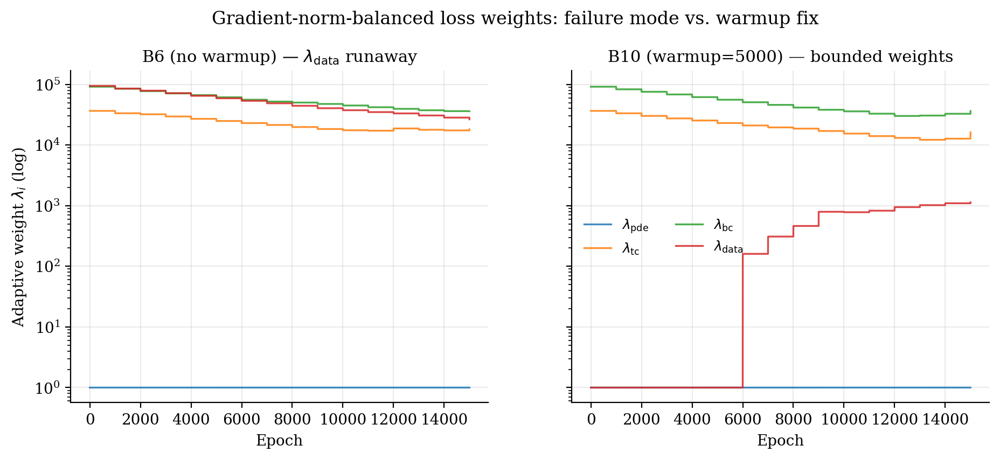
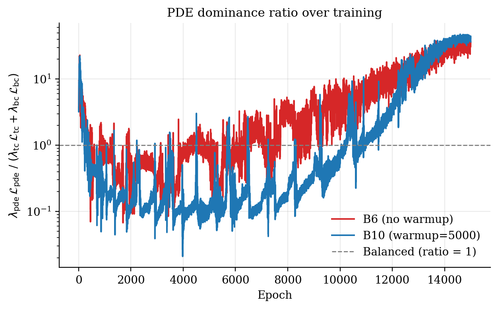
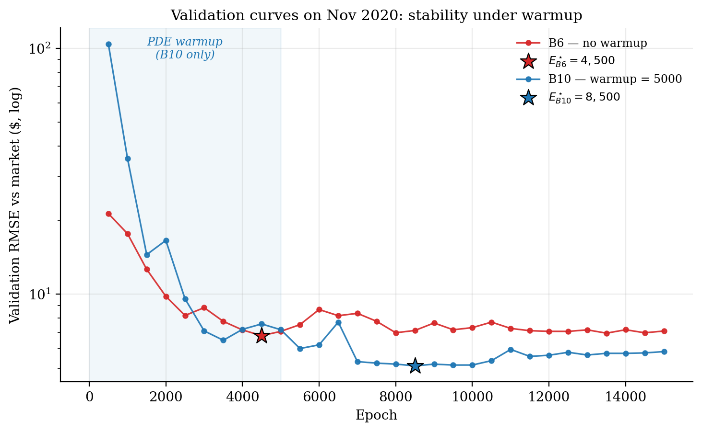
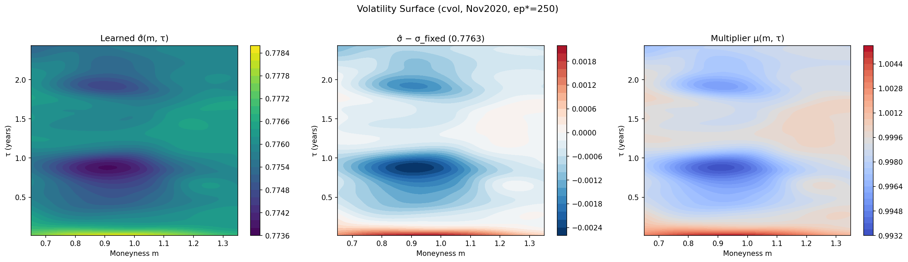

```{python}
#| label: setup
#| include: false
# Boilerplate for every chunk that follows. Paths are resolved relative
# to the project root because Quarto runs each chunk in the .qmd's dir.
import json
import os
import sys
from pathlib import Path

import numpy as np
import pandas as pd

# Anchor at project root so we can pull from results/ and reports/
HERE = Path(os.getcwd())
ROOT = HERE.parent if HERE.name == "paper" else HERE
RESULTS = ROOT / "results"
REPORTS = ROOT / "reports"
RUNS    = ROOT / "runs"
FIGS    = HERE / "figures"
TABLES  = HERE / "tables"
FIGS.mkdir(exist_ok=True)
TABLES.mkdir(exist_ok=True)

def load_json(p):
    p = Path(p)
    return json.load(open(p)) if p.exists() else None

def fmt_dollar(x, nd=2):
    return "—" if x is None or (isinstance(x, float) and np.isnan(x)) else f"\\${x:.{nd}f}"

def fmt_pct(x, nd=1):
    return "—" if x is None or (isinstance(x, float) and np.isnan(x)) else f"{x*100:.{nd}f}\\%"

def to_gfm(df, floatfmt=".3f"):
    """Hand-rolled GitHub-flavored markdown table writer — avoids the
    pandas.to_markdown() dependency on `tabulate`."""
    def _cell(v):
        if v is None or (isinstance(v, float) and np.isnan(v)):
            return "—"
        if isinstance(v, float):
            return f"{v:{floatfmt}}"
        return str(v)
    cols = list(df.columns)
    head = "| " + " | ".join(cols) + " |"
    sep  = "|" + "|".join(["---"] * len(cols)) + "|"
    body = "\n".join("| " + " | ".join(_cell(r[c]) for c in cols) + " |"
                     for _, r in df.iterrows())
    return f"{head}\n{sep}\n{body}"
```

# Introduction

The Black–Scholes formula [@blackscholes1973; @merton1973] remains the
reference language of derivatives pricing despite decades of empirical
evidence that its constant-volatility assumption is wrong. The two
dominant responses — calibrating local or stochastic volatility models
[@dupire1994; @heston1993], or fitting flexible machine-learning
regressors to market quotes — solve different parts of the problem and
inherit different limitations. Calibration imposes structure but
suffers parameter instability across regimes. Pure ML methods deliver
fit but offer no guarantee that the resulting prices are even
*internally consistent*: arbitrage violations such as butterfly or
calendar negatives are routinely tolerated because they are rarely
measured.

Physics-informed neural networks (PINNs) [@raissi2019] are appealing
in this setting because they enforce the pricing PDE as a soft
constraint during training. In principle, this combines the structural
discipline of model-based pricing with the flexibility of neural
function approximation. In practice, the PINN literature on options
pricing has three recurrent gaps:

1. experiments use synthetic data or single in-sample fits rather
   than walk-forward backtests;
2. the volatility entering the PDE is held *constant*, identical to a
   single-σ Black–Scholes baseline, eliminating the very degree of
   freedom the network is meant to learn;
3. no-arbitrage properties of the trained surface are reported only
   when they happen to be clean.

This paper closes those three gaps on a single-name equity option
dataset (TSLA, 2020). Our contributions are:

1. **Walk-forward PINN benchmark.** Nine monthly folds across 2020,
   strict val-best snapshot reporting, and a 13-configuration
   architecture ablation (random weight factorization $\mu$ ×
   loss-balancing strategy × hybrid vs. physics-only mode). Stage 1
   establishes that with appropriate Modified-MLP + RWF + Fourier-feature
   architecture [@wang2023expert; @tancik2020fourier] and a PDE-warmup
   schedule, the PINN matches a per-fold-σ Black–Scholes baseline on
   pooled RMSE while introducing a *wing inversion* in stratified
   error — the only configuration in our ablation grid where
   out-of-the-money and in-the-money RMSE both improve relative to
   at-the-money.

2. **Stage 2: learnable σ surface.** We replace the constant-σ
   assumption inside the PDE with a learned surface
   $\sigma_\theta(F,\tau)$ realised via two parametrizations: a
   multiplicative *C-Vol* wrapper
   $\sigma(F,\tau) = \sigma_0 \cdot \mathrm{softplus}(g_\theta(F,\tau))$
   and a direct *A-Vol* parametrization
   $\sigma(F,\tau) = \sigma_\mathrm{init} + \mathrm{softplus}(g_\theta(F,\tau))$.
   Both are warm-started from the two endpoints of the Stage 1
   ablation: B10 (best pricing accuracy, structural arb violations) and
   B12 (cleanest no-arb surface, marginally worse pricing).

3. **Arbitrage as a first-class metric.** Every reported model is
   evaluated for butterfly and calendar arbitrage on a dense
   $(F,\tau)$ grid. We treat the violation rate as a primary metric
   on equal footing with RMSE, exposing the trade-off that pure-RMSE
   reporting conceals.

4. **Honest non-PINN baselines.** A residual GAM [@wood2017gam] and a
   local approximate Gaussian process [@gramacy2016lagp] are evaluated
   under identical walk-forward folds and the strict feature set the
   PINN sees, removing regime-indicator contamination present in
   earlier formulations. The laGP fit additionally produces native
   95% predictive intervals that we retain as the comparison baseline
   for the uncertainty extension outlined in
   Section [-@sec-discussion].

```{python}
#| label: tbl-headline
#| tbl-cap: "Headline results: pooled RMSE in dollars and arbitrage violation rates across baseline classes. Wing inversion ($\\mathrm{RMSE}_\\mathrm{wing} < \\mathrm{RMSE}_\\mathrm{ATM}$) appears only in the B10 configuration."
mt = pd.read_csv(REPORTS / "master_table.csv") if (REPORTS / "master_table.csv").exists() else None
if mt is not None:
    keep = ["BS_A1", "GAM_A2", "LAGP_A3",
            "B0_standard_physics", "B1_standard_hybrid",
            "B10_modified_hybrid_mu0.75_warmup5000",
            "B12_modified_hybrid_mu0.25_warmup5000"]
    sub = mt[mt["config"].isin(keep)].copy()
    show_cols = ["config", "pooled_rmse", "pooled_rmse_atm",
                 "pooled_rmse_wing", "arb_butterfly%", "arb_calendar%"]
    show_cols = [c for c in show_cols if c in sub.columns]
    sub = sub[show_cols].rename(columns={
        "config":             "Config",
        "pooled_rmse":        "RMSE (\\$)",
        "pooled_rmse_atm":    "ATM (\\$)",
        "pooled_rmse_wing":   "Wing (\\$)",
        "arb_butterfly%":     "Butt \\%",
        "arb_calendar%":      "Cal \\%",
    })
    from IPython.display import Markdown
    Markdown(to_gfm(sub))
else:
    Markdown("*Table will populate once `python scripts/build_master_table.py` "
             "has been run after Stage 2 results land.*")
```

The remainder of the paper is organized as follows.
Section [-@sec-background] reviews the necessary PDE and PINN background.
Section [-@sec-methodology] details data preprocessing, walk-forward
methodology, and the three-stage architecture.
Section [-@sec-stage1] presents Stage 1 ablation results.
Section [-@sec-stage2] the Stage 2 vol-surface results.
Section [-@sec-baselines] compares against non-PINN baselines.
Section [-@sec-discussion] discusses limitations and outlines the
uncertainty-quantification extension; Section [-@sec-conclusion]
concludes.

# Background {#sec-background}

## The Black–Scholes pricing PDE

For a European call on a non-dividend-paying underlying $S_t$ under
the risk-neutral measure with constant interest rate $r$ and
volatility $\sigma$, the option price $V(S,t)$ satisfies

$$
\frac{\partial V}{\partial t}
+ \frac{1}{2}\sigma^2 S^2 \frac{\partial^2 V}{\partial S^2}
+ r S \frac{\partial V}{\partial S} - r V = 0,
$$ {#eq-bs-pde}

with terminal condition $V(S, T) = (S - K)^+$ and boundary conditions
$V(0, t) = 0$, $V(S, t) \to S - K e^{-r(T-t)}$ as $S \to \infty$.

We work in non-dimensionalised coordinates throughout: moneyness
$m = F/K$ where $F = S e^{(r-q)(T-t)}$ is the forward price, time to
expiry $\tau = T - t$, and price $\hat v = V/K$.

## Physics-informed neural networks

A PINN $\hat v_\phi(m,\tau)$ is trained to minimise a composite loss

$$
\mathcal{L}(\phi) = \lambda_\mathrm{pde}\mathcal{L}_\mathrm{pde}
+ \lambda_\mathrm{tc}\mathcal{L}_\mathrm{tc}
+ \lambda_\mathrm{bc}\mathcal{L}_\mathrm{bc}
+ \lambda_\mathrm{data}\mathcal{L}_\mathrm{data}
+ \lambda_\mathrm{reg}\mathcal{L}_\mathrm{reg},
$$ {#eq-loss}

where $\mathcal{L}_\mathrm{pde}$ is the squared residual of
@eq-bs-pde at collocation points, $\mathcal{L}_\mathrm{tc}$ and
$\mathcal{L}_\mathrm{bc}$ enforce terminal and boundary conditions,
$\mathcal{L}_\mathrm{data}$ is the mean squared error against market
mid-prices, and $\mathcal{L}_\mathrm{reg}$ regularises soft-plus
arguments. The adaptive weights $\{\lambda_i\}$ are updated via the
gradient-norm scheme of @wang2023expert.

## No-arbitrage diagnostics

A theoretical option price surface $V(K,\tau)$ must satisfy two
inequalities almost everywhere:

$$
\frac{\partial^2 V}{\partial K^2} \ge 0
\quad\text{(butterfly, convexity in strike)},
$$ {#eq-butterfly}

$$
\frac{\partial V}{\partial \tau} \ge 0
\quad\text{(calendar, monotonicity in maturity)}.
$$ {#eq-calendar}

We measure violation rates by Monte Carlo over a dense $(K,\tau)$ grid;
see Section [-@sec-methodology] for the implementation.

# Methodology {#sec-methodology}

The three stages compose incrementally: Stage 1 inherits Stage 0's
PDE residual + boundary conditions and adds Modified-MLP, Random
Weight Factorization, Fourier-feature inputs, gradient-norm balancing,
the market-data loss, walk-forward folds, and val-best snapshot
reporting; Stage 2 inherits all of that and adds a learned
$\sigma_\theta(F,\tau)$ network jointly trained with a warm-started
pricing net (Figure [-@fig-architecture]).

{#fig-architecture width=100%}

## Data and walk-forward folds

We use end-of-day TSLA option chain quotes from 2020, split-adjusted
for the August 2020 5:1 stock split. After standard cleaning (positive
mid-price, in-the-money intrinsic value bounds, removal of
zero-volume quotes), the cleaned panel contains 59,668 option-day
observations across 252 trading days.

Folds are monthly and walk-forward: for fold $f$ (test month $M_f$),
training spans all data strictly before the start of $M_{f-1}$, the
last calendar month of training is held out as the validation set
$M_{f-1}$, and the test set is $M_f$ (Figure [-@fig-walkforward]).
This yields nine folds covering April through December 2020.
Per-fold constants are computed *only* from training data:
$\sigma_\mathrm{fixed}$ is the median of ATM implied volatilities
and $r_\mathrm{fixed}$ the cross-sectional mean of risk-free rates.

{#fig-walkforward width=90%}

## PINN architecture

The pricing network is a Modified-MLP [@wang2023expert] with Fourier
feature embedding [@tancik2020fourier] at the input layer and Random
Weight Factorization (RWF) on every linear layer. All activations
are $\tanh$ to permit second-order autograd for the PDE residual.

We sweep a $\mu \in \{0.0, 0.25, 0.5, 0.75, 1.0\}$ ablation in
combination with: hybrid vs. physics-only loss, fixed vs.
gradient-norm-balanced data weight, and PDE-warmup vs. immediate-data
training. The full grid is reported in Section [-@sec-stage1].

## Stage 2: learnable volatility

A second network $g_\theta(F,\tau)$ produces the volatility surface.
We compare two parametrizations:

$$
\sigma_\mathrm{C}(F,\tau)
  = \sigma_0 \cdot \mathrm{softplus}\bigl(g_\theta(F,\tau)\bigr),
\qquad
\sigma_\mathrm{A}(F,\tau)
  = \sigma_\mathrm{init} + \mathrm{softplus}\bigl(g_\theta(F,\tau)\bigr),
$$ {#eq-vol-params}

where $\sigma_0$ is the per-fold-$\sigma_\mathrm{fixed}$ anchor
(C-Vol) and $\sigma_\mathrm{init}$ is the same value used as an
additive offset (A-Vol). The pricing network is warm-started from a
Stage 1 fold checkpoint; the volatility network is trained from
scratch with its own learning rate $\eta_\mathrm{vol} = 10^{-3}$,
above the pricing fine-tune rate $\eta_\mathrm{price} = 10^{-4}$.

## Baselines {#sec-baselines-method}

Three non-PINN baselines run on identical fold definitions:

* **A1 — Black–Scholes (per-fold $\sigma$).** Closed-form
  @eq-bs-pde with $\sigma = \sigma_\mathrm{fixed}$ and
  $r = r_\mathrm{fixed}$ both computed from training data only.
* **A2 — Residual GAM.** Target is $y = \mathrm{mid} - V_\mathrm{BS}$,
  fit with `mgcv::gam` using
  $y \sim \mathrm{te}(m,\tau,k=(8,5)) + \mathrm{ns}(\log v, \mathrm{df}=2)$,
  REML smoothing.
* **A3 — Residual laGP.** Same target as A2; local approximate GP
  with start=6, end=50 [@gramacy2016lagp], yielding native 95%
  predictive intervals retained as the credible-interval baseline
  for the uncertainty extension in Section [-@sec-uq-future].

# Stage 1: Walk-forward ablation {#sec-stage1}

```{python}
#| label: tbl-stage1
#| tbl-cap: "Full Stage 1 ablation (B0–B12). RMSE pooled across all 9 folds. The wing inversion ($\\mathrm{RMSE}_\\mathrm{wing} < \\mathrm{RMSE}_\\mathrm{ATM}$) appears only in B10 (modified-hybrid, $\\mu=0.75$, warmup=5000)."
if mt is not None:
    show = mt[mt["config"].str.startswith("B")].copy()
    cols = ["config", "pooled_rmse", "pooled_rmse_otm", "pooled_rmse_atm",
            "pooled_rmse_itm", "pooled_rmse_wing",
            "arb_butterfly%", "arb_calendar%"]
    cols = [c for c in cols if c in show.columns]
    Markdown(to_gfm(show[cols]))
else:
    Markdown("*Awaiting `reports/master_table.csv`.*")
```

## Headline: pricing accuracy vs. arbitrage consistency {#sec-pareto}

Figure [-@fig-arb-rmse-pareto] plots the pooled RMSE against the
combined butterfly + calendar arbitrage violation rate for each of
the 13 ablation cells, with the BS_A1 and GAM_A2 baselines drawn as
horizontal references. B10 (modified-hybrid, $\mu = 0.75$,
warmup = 5{,}000) is the unique Pareto-frontier point in the
lower-left of the plane: it achieves the lowest pooled RMSE of any
configuration *and* sits below the BS_A1 baseline, while paying a
moderate (32% / 19%) arbitrage-violation cost. Configurations
without warmup (B5–B7) cluster in the upper right — high RMSE *and*
high arb%, the worst quadrant.

{#fig-arb-rmse-pareto width=85%}

## The wing-inversion finding {#sec-wing-inversion}

Figure [-@fig-stratified-rmse] decomposes pooled RMSE by moneyness
band. Across all 12 other configurations and the BS_A1 baseline,
RMSE follows the classical pattern OTM $\geq$ ATM $\geq$ ITM —
volatility-skew effects dominate the residual error in the wings.
**B10 is the only configuration where this ordering inverts**: ATM
RMSE ($8.83) exceeds both OTM RMSE ($8.48) and ITM RMSE ($8.21).
Equivalently, the *wing* RMSE — pooled across OTM and ITM — drops
below the ATM RMSE. This is the structural signature of a PINN that
has actually learned the volatility smile rather than collapsing to
a flat-vol residual: the network deviates from the constant-$\sigma$
BS surface specifically where the smile has the most curvature.
Configurations with the same $\mu$ but no warmup (B6) — or warmup
with different $\mu$ (B11, B12) — never exhibit this inversion.

{#fig-stratified-rmse width=100%}

## Stability and convergence diagnostics {#sec-stability}

The non-warmup hybrid configurations B5–B7 collapse on RMSE *and*
on arbitrage simultaneously (Figure [-@fig-arb-rmse-pareto]).
Per-loss curves and adaptive-weight trajectories explain why.
Figure [-@fig-loss-curves-stability] contrasts B6 (failure mode:
modified hybrid, $\mu=0.75$, no warmup) with B10 (same architecture
+ a 5{,}000-epoch PDE-warmup). In B6, the market-data loss
$\mathcal{L}_\mathrm{data}$ enters at full strength from epoch 1
and is poorly balanced by the gradient-norm scheme; the adaptive
weight $\lambda_\mathrm{data}$ runs to $\sim 10^{5}$
(Figure [-@fig-weight-traj-stability]), which numerically suppresses
the PDE residual. The PDE-dominance ratio
$\lambda_\mathrm{pde}\mathcal{L}_\mathrm{pde} /
(\lambda_\mathrm{tc}\mathcal{L}_\mathrm{tc} +
\lambda_\mathrm{bc}\mathcal{L}_\mathrm{bc})$ collapses
(Figure [-@fig-pde-dominance]), and with it the model's adherence
to the no-arbitrage geometry. The 5{,}000-epoch warmup window in
B10 lets $\mathcal{L}_\mathrm{pde}$, $\mathcal{L}_\mathrm{tc}$,
and $\mathcal{L}_\mathrm{bc}$ converge to a stable balance *before*
the data loss is admitted; the subsequent joint training stays in
the physically consistent region the warmup phase established.

::: {layout-ncol=1}
{#fig-loss-curves-stability}

{#fig-weight-traj-stability}

{#fig-pde-dominance}
:::

## $\mu \times \mathrm{warmup}$: substitutes, not complements {#sec-mu-warmup}

Within the warmup family (B10/B11/B12), pooled RMSE rises by $0.26
as $\mu$ drops from 0.75 to 0.25, and the wing inversion is lost
(Figure [-@fig-stratified-rmse]). The validation curves
(Figure [-@fig-val-curve-mu-warmup]) show the corresponding shift in
the val-best epoch $E^\star$: B10 selects later, B12 selects very
early — the lower-$\mu$ initialization is closer to flat-$\sigma$
BS, so the network has less to learn before the val curve flattens.
We conclude that $\mu$-tuning and the warmup phase are
**substitutes**: warmup does the heavy lifting of restoring stability
under hybrid losses, and $\mu = 0.75$ is the companion that maximises
the pricing benefit; lowering $\mu$ inside warmup gives back most
of the gain without an offsetting reduction in arbitrage.

{#fig-val-curve-mu-warmup width=80%}

# Stage 2: learnable volatility surface {#sec-stage2}

```{python}
#| label: tbl-stage2
#| tbl-cap: "Stage 2 walk-forward results: $2 \\times 2$ design (warm start $\\in$ {B10, B12}, vol parametrization $\\in$ {C-Vol, A-Vol})."
s2_paths = {
    "B10 / C-Vol": RUNS / "stage2_B10" / "cvol" / "results.json",
    "B10 / A-Vol": RUNS / "stage2_B10" / "avol" / "results.json",
    "B12 / C-Vol": RUNS / "stage2_B12" / "cvol" / "results.json",
    "B12 / A-Vol": RUNS / "stage2_B12" / "avol" / "results.json",
}
rows = []
for name, p in s2_paths.items():
    r = load_json(p)
    if r is None:
        rows.append({"Config": name, "pooled RMSE": "—",
                     "ATM": "—", "OTM": "—", "ITM": "—",
                     "butt%": "—", "cal%": "—"})
    else:
        s = r["summary"]
        rows.append({
            "Config": name,
            "pooled RMSE": f"\\${s['pooled_rmse_mkt']:.3f}",
            "ATM":         f"\\${s['pooled_rmse_atm']:.3f}",
            "OTM":         f"\\${s['pooled_rmse_otm']:.3f}",
            "ITM":         f"\\${s['pooled_rmse_itm']:.3f}",
            "butt%":       f"{s['mean_arb_butterfly_ratio']*100:.1f}\\%",
            "cal%":        f"{s['mean_arb_calendar_ratio']*100:.1f}\\%",
        })
Markdown(to_gfm(pd.DataFrame(rows), floatfmt=""))
```

**C-Vol vs A-Vol.** [the multiplicative inductive bias finding]

**Warm-start dependence.** [does B12 win on RMSE? on arb%?]

**Vol surface visualisation.**

{#fig-vol-surface width=70%}

# Non-PINN baselines {#sec-baselines}

```{python}
#| label: tbl-baselines
#| tbl-cap: "Non-PINN baselines under identical walk-forward folds and strict feature set."
if mt is not None:
    show = mt[mt["config"].isin(["BS_A1", "GAM_A2", "LAGP_A3"])].copy()
    cols = ["config", "pooled_rmse", "pooled_rmse_atm", "pooled_rmse_wing"]
    cols = [c for c in cols if c in show.columns]
    Markdown(to_gfm(show[cols]))
else:
    Markdown("*Awaiting `reports/master_table.csv`.*")
```

[BS-with-strict-σ explanation; why GAM under-performs without
regime indicator; laGP coverage and PI width]

# Discussion {#sec-discussion}

## Pooled vs. mean-fold RMSE

[brief on fold-level heterogeneity]

## Limitations

* Single-name dataset; results may not generalise to indices or
  multi-name baskets.
* 2020 spans both the COVID crash and the S&P-inclusion melt-up —
  fold $f$=Apr 2020 has only 12,743 training observations, far less
  than fold $f$=Dec 2020.
* No transaction-cost or trading-strategy evaluation.

## Future direction: uncertainty quantification {#sec-uq-future}

The walk-forward and val-best protocol above produces a single point
estimate per fold. A natural extension applies anchored ensembles
[@kazemian2024]: train $K$ replicas of the Stage 2 PINN, each with
a Gaussian anchor on its initial weights, and read 95% predictive
intervals from the empirical quantiles across the ensemble. The
existing laGP baseline (Section [-@sec-baselines-method]) provides
a non-PINN credible-interval comparator under the *same* fold
definitions and information set, so the comparison is calibrated
on coverage rate and average interval width without re-running the
non-PINN side. This is the planned next step; we leave its
implementation, ensemble-size sweep, and coverage-vs-width
analysis to subsequent work.

# Conclusion {#sec-conclusion}

# References {.unnumbered}

::: {#refs}
:::
